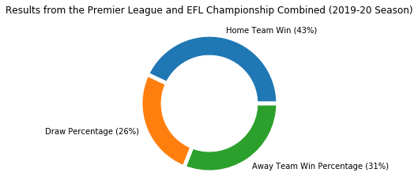
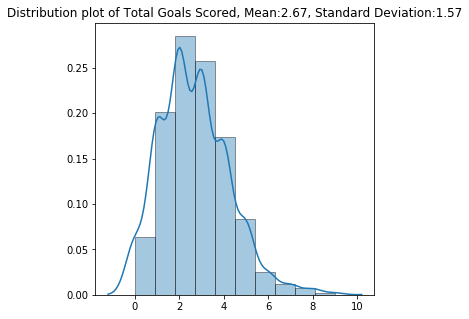
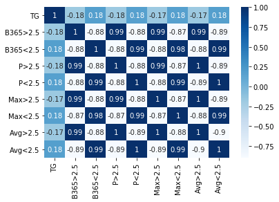
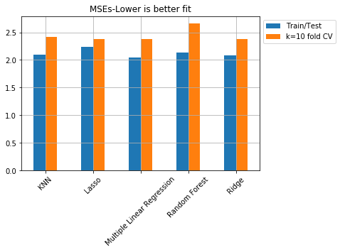

# How Many Goals will be Scored? (Comparing different Regression Methods)

## Part 1: Project Background

#### In this project, I compared different regression models to predict the total number of goals in the Premier League and EFL Championship 2019-2020 season. As an avid fan of statistics, soccer, and prediction, I've always been curious about whether it is possible to predict the total number of goals scored. In this project, I've used different regression methods - Multiple Linear Regression, Lasso Regression, Ridge Regression, K-Nearest Neighbor Regressor, and Random Forest Regressor to predict the total number of goals scored in a game played in the Premier League and EFL Championship. The dataset can be obtained here: https://www.football-data.co.uk/englandm.php

#### The reason I didn't use the classification method (because number of goals scored is a discrete variable... there is no 2.1 goals) is because I wanted to implement the model of choice in predicting the outcome for the U/O 2.5Goals category in soccer betting. I wanted to see if I could predict the total number of goals as precise as possiblt to predict that betting result.

## Part 2: Data Cleaning

#### - Merged datasets (EFL Championship + Premier League) and created 'TG' (Total Goals) column that is the sum of 'FTHG (Full Time Home Team Goals)' and 'FTAG (Full Time Away Team Goals)'
#### - Dropped a row containing two columns of missing data

## Part 3: Exploratory Data Analysis
#### - Total number of matches ending in a draw only consists of 26 percent of the total (instead of 33 percent) and Home Teams win more than Away Teams do (43% vs 31%)
#### - 
#### - Total number of goals have a mean of 2.67 and standard deviation of 1.57. The most total number of goals seems to be in the 2~3 goals range.
#### - 
#### - Correlation map shows that total number of goals has pretty low correlation coefficients. 
#### - 

## Part 4: Model Building and Evaluation

#### - The target variable was set to the 'TG (Total Goals)' column and predictor variables were 'B365>2.5 (betting odds from Bet 365 that total number of goals exceeds 2.5)', 'B365<2.5 (betting odds from Bet 365 that total number of goals does not exceed 2.5)', 'P>2.5 (betting odds from Pinnacle that total number of goals exceeds 2.5)', 'P<2.5 (betting odds from Pinnacle that total number of goals does not exceed 2.5)', 'Max>2.5 (max betting odds in the market of total goals>2.5)', 'Max<2.5 (max betting odds in the market of total goals<2.5)', 'Avg>2.5 (average betting odds in the market of total goals>2.5)', 'Avg<2.5 (average betting odds in the market of total goals>2.5)'.

#### - 

#### - Results) Based on the train/test data split process, Multiple Linear Regression performed the best. However, based on the k = 10 fold Cross Validation process, Lasso and Ridge regression with alpha values as 1 performed the best.

## Part 5: What I've Learned and Further Questions

#### - Different regression methods and searching for the best parameters for certain models (Lasso, Ridge(alpha values), Random Forest(number of trees), etc.)
#### - Distribution of the dataset (most matches had 2~3 total goals scored in them)
#### - Negative R-squared values -> worth looking into the reason why I had such results (Lasso, KNN, Random Forest)
#### - Why did some models perform better than others? (also, why did Ridge and Lasso regression have the same k = 10 CV MSE values?)
#### - If this was a classification problem (on predicting total number of goals scored) would the results have been any different?

## Part 6: Resources that I've Learned from to build this project

#### -(Dataset)https://www.football-data.co.uk/englandm.php
#### -(Decision Trees vs Random Forest) https://stats.stackexchange.com/questions/285834/difference-between-random-forests-and-decision-tree
#### -(Decision Trees vs Random Forest) https://towardsdatascience.com/decision-trees-and-random-forests-df0c3123f991
#### -(Example of using GridsearchCV(tuning parameters)-KNN) https://medium.com/@erikgreenj/k-neighbors-classifier-with-gridsearchcv-basics-3c445ddeb657
#### -(Example of using GridsearchCV(tuning parameters)-Lasso,Ridge-CV) https://towardsdatascience.com/how-to-perform-lasso-and-ridge-regression-in-python-3b3b75541ad8
#### -(R^2 as a way to compare models for best-fit?) https://data.library.virginia.edu/is-r-squared-useless/
#### -(Ways to measure best fit for regression models) https://www.theanalysisfactor.com/assessing-the-fit-of-regression-models/
#### -(The scoring parameter: defining model evaluation rules in cross_val_score) https://scikit-learn.org/stable/modules/model_evaluation.html#scoring-parameter
#### -(low R squared values aren't always bad->R squared may be lower for values harder to predict) https://statisticsbyjim.com/regression/interpret-r-squared-regression/
#### -(low and high alpha values on ridge regression) https://stackoverflow.com/questions/59706137/what-is-alpha-in-ridge-regression#:~:text=If%20Alpha%20is%20close%20to,and%20better%20generalize%20the%20coefficients.
#### -(example of ridge and lasso regression in Python)https://www.pluralsight.com/guides/linear-lasso-ridge-regression-scikit-learn
#### -(GridSearchCV with test/train data-KNN)https://towardsdatascience.com/grid-search-for-hyperparameter-tuning-9f63945e8fec
#### -(what a negative R-squared value implies)https://stats.stackexchange.com/questions/12900/when-is-r-squared-negative
#### -***(random forest using gridsearchCV)https://www.kaggle.com/sociopath00/random-forest-using-gridsearchcv
#### -***(Lasso, Ridge)https://github.com/krishnaik06/RegressionandLasso/blob/master/Lassoand%20Regression.ipynb
